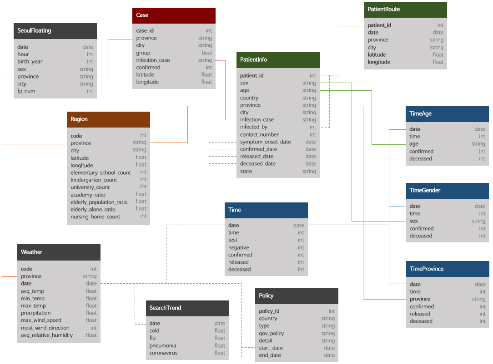

# COVID-19 Data Analysis

## Goal of the Project

This project performs an exploratory data analysis (EDA) of the COVID-19 patient-level data of South Korea and aims to get the most critical insights and use them for creating a plan of fighting the next wave of the pandemics.

## Components of the analysis

- Overview of COVID-19 patients information in South Korea
- Analysis of COVID-19 cases of age and sex subgroups of South Korean population
- Spread of COVID-19 infection in the provinces of South Korea
- Overview of the main group infections in South Korea
- Accumulation of COVID-19 cases in time
- Relationship between COVID-19 incidence and other factors in South Korean regions
- Relationship between COVID-19 incidence and floating population in Seoul province
- Relationship between the spread of COVID-19 infection and weather conditions
- Overview of COVID-19 Infection Control Strategy in South Korea

## Datasets used in the analysis:

1) **Case Data:**
    - `Case`: Data of COVID-19 infection cases in South Korea
2) **Patient Data:**
    - `PatientInfo`: Epidemiological data of COVID-19 patients in South Korea
3) **Time Series Data:**
    - `Time`: Time series data of COVID-19 status in South Korea
    - `TimeAge`: Time series data of COVID-19 status in terms of the age in South Korea
    - `TimeGender`: Time series data of COVID-19 status in terms of gender in South Korea
    - `TimeProvince`: Time series data of COVID-19 status in terms of the Province in South Korea
4) **Additional Data:**
    - `Region`: Location and statistical data of the regions in South Korea
    - `SeoulFloating`: Data of floating population in Seoul, South Korea (from SK Telecom Big Data Hub)
    - `Weather`: Data of the weather in the regions of South Korea (from Korea Meteorological Administration)
    - `Policy`: Data of the government policy for COVID-19 in South Korea

 

> Note: *PatientRoute.csv is currently not available because of privacy issue.*

Datasets were downloaded from [Kaggle](https://www.kaggle.com/datasets/kimjihoo/coronavirusdataset).